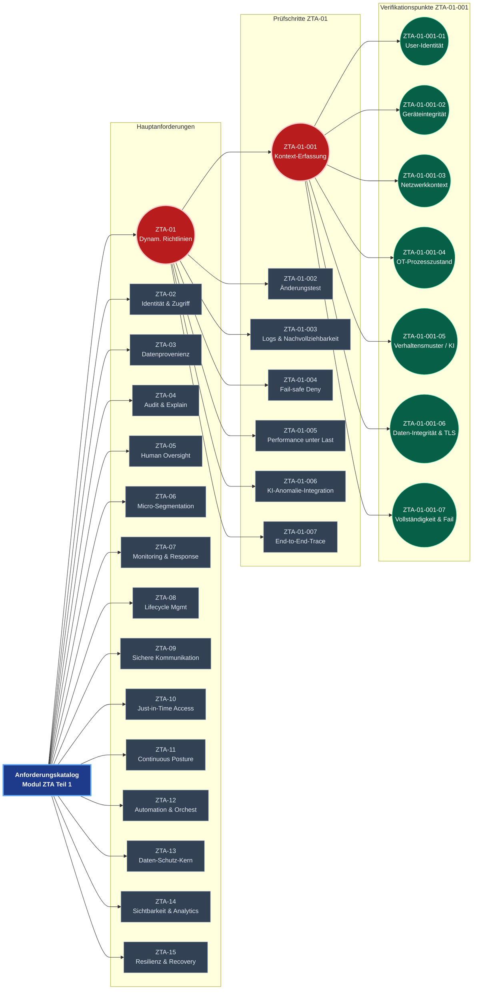

# Scope

## Architektur der Modul-Teile 1–3

Die drei Modul-Teile beschreiben gemeinsam einen vollständigen Verifikationsbau:

- **Modul ZTA Teil 1** definiert den generischen Anforderungskatalog mit 15 Anforderungen (ZTA-01 bis ZTA-15). Jede Anforderung ist gleichwertig und vollständig spezifiziert.
- **Modul ZTA Teil 2** beschreibt für jede Anforderung die zugehörigen Prüfschritte. Pro Anforderung sind typischerweise 5–10 Prüfschritte vorgesehen.
- **Modul ZTA Teil 3** liefert für jeden Prüfschritt die granulare attributbasierte Verifikation mit konkreten Kontextdimensionen, erwarteten Ergebnissen und Evidenz-Nachweisen.

Der vollständige Bau würde damit mehrere hundert Verifikationspunkte umfassen – eine substanzielle Ingenieurs- und Compliance-Leistung, die im Rahmen dieses Projekts bewusst nicht vollständig ausgearbeitet wird.

## Exemplarischer Pfad

Aktuell ist **genau ein Pfad** vollständig und inhaltlich belastbar ausgearbeitet:

**ZTA-01 → ZTA-01-001 → ZTA-01-001-01 bis -07**

Dieser Pfad ist nicht als Platzhalter zu verstehen, sondern als vollwertiges, auditierbares Beispiel – er zeigt exemplarisch, wie der Gesamtkatalog in der Tiefe aussehen würde und welche Qualität für alle weiteren Äste anzustreben ist. Alle übrigen Anforderungen (ZTA-02 bis ZTA-15) sowie deren Prüfschritte und Verifikationspunkte sind in Teilen 2 und 3 noch nicht ausgearbeitet und müssen analog ergänzt werden.

## Strukturübersicht

Das folgende Diagramm zeigt den vollständigen Bau. Rot markiert ist der aktuell ausgearbeitete Pfad, grün die granularen Verifikationspunkte, grau die noch ausstehenden Äste:

## Erweiterung

Jede neue Ausarbeitung eines weiteren Pfades (z. B. ZTA-02 mit seinen Prüfschritten und Verifikationspunkten) folgt exakt der hier gezeigten Struktur und Qualität. Der exemplarische Pfad ZTA-01 dient dabei als verbindliche Vorlage.
