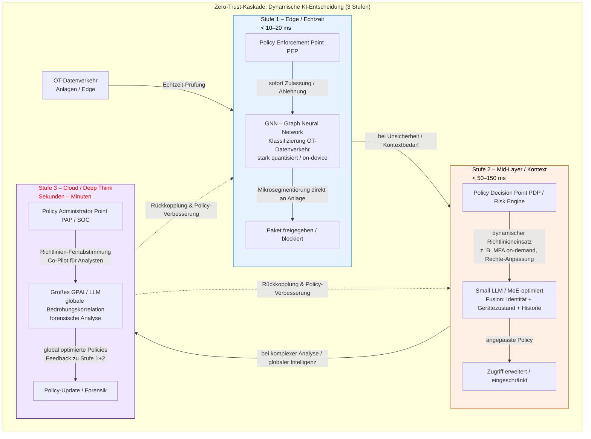

# Systemtheoretische Beschreibung der industriellen ZTA-Kaskade

## 1. Präambel: Evolution der Wahrnehmungstiefe
Die **industrielle Zero Trust Architektur (ZTA)** darf nicht als statische Filterinstanz missverstanden werden. Sie stellt vielmehr ein kognitives Schichtmodell dar, das eine Evolution der Wahrnehmungstiefe realisiert. Während herkömmliche Systeme auf binären Entscheidungslogiken operieren, delegiert die ZTA-Kaskade die Inferenzlast basierend auf der erforderlichen Kontextdimension. Dies ermöglicht eine Auflösung des Zielkonflikts zwischen deterministischer OT-Echtzeitfähigkeit und hochdimensionaler semantischer Analyse.

## 2. Die Schichten der Inferenz-Kaskade

## Stufe 1: Topologische Integrität (Die „Eh-da-Ebene“ / 2D-Abbild)

* **Technologische Basis:** Inhärente, qualitätsgesicherte OT-Infrastruktur (Bestands-Assets).
* **Wissenschaftliche Einordnung:** Diese Ebene fungiert als flächenhaft verteilter Integritäts-Anker. Sie operiert auf der syntaktischen Ebene des Datenverkehrs, wobei Graph Neural Networks (GNN) die Systemzustände als flache 2D-Topologie $G=(V,E)$ abbilden.
* **Funktionale Limitation:** Die Inferenz ist hochperformant und deterministisch, jedoch „kontextblind“. Anomalien werden als statistische Abweichungen vom White-Boxing-Referenzzustand detektiert, ohne deren kausale Ursache (z. B. Prozessumstellung vs. Cyber-Angriff) zu interpretieren.

## Stufe 2: Semantische Extension (Die Branchen-Ebene / 2,5D-Kontext)

* **Technologische Basis:** Edge-basierte Small Language Models (SLM) und Mixture-of-Experts (MoE) Architekturen.
* **Wissenschaftliche Einordnung:** Diese Ebene integriert branchen- und unternehmensspezifisches Domänenwissen (Business Logic). Sie transformiert das flache 2D-Abbild in eine 2,5D-Struktur, indem sie den topologischen Vektor mit prozessualen Metadaten faltet.
* **Funktionale Leistung:** Stufe 2 validiert die Meldungen der Stufe 1 kontextuell. Sie erkennt Reliefs und Strukturen des eigenen Ökosystems (z. B. autorisierte Wartungsfenster oder Batch-Zyklen) und reduziert dadurch signifikant die Rate an False-Positives.

## Stufe 3: Globale Strategie-Inferenz (Die Weltwissen-Ebene / 3D-Modell)

* **Technologische Basis:** Cloud-basierte General Purpose AI (GPAI) / Large Language Models (LLM).
* **Wissenschaftliche Einordnung:** Diese Ebene repräsentiert die maximale Inferenzdimension (3D-Globalmodell). Sie verfügt über externes Weltwissen, Threat Intelligence und regulatorische Anforderungen (EU AI Act, NIST).
* **Funktionale Leistung:** Stufe 3 agiert als strategische Instanz für die „Tiefenbohrung“ und das „Reframing“. Sie erkennt globale Angriffsmuster und weist Stufe 1 und 2 autonom neu an, indem sie Schwellenwerte rekalibriert und adaptive Filterregeln für die Stufe 2 generiert.

## 3. Synergie und Distributed Intelligence
Die Resilienz des Gesamtkonstrukts ergibt sich aus der bidirektionalen Validierung:

* **Bottom-Up Validierung:** Die strategische Analyse der Stufe 3 basiert auf der unverfälschten „physischen Wahrheit“ der Stufe 1.
* **Top-Down Instruktion:** Globale Sicherheitsstrategien werden durch Stufe 2 in maschinenlesbare, prozessnahe Instruktionen übersetzt.

Dieses Modell beschreibt eine Distributed Intelligence Architecture, in der Vertrauen eine dynamische Funktion des Kontextes ist. Die „Eh-da-Welt“ liefert die physische Evidenz, die Stufe 2 die prozessuale Validität und die Stufe 3 die globale Souveränität.

Die Verlässlichkeit der strategischen Inferenz (Stufe 3) wird durch den in Anhang 2 dokumentierten iterativen Approximations-Ansatz sichergestellt. Hierbei werden stochastische Unsicherheiten der GPAI-Modelle durch einen strukturierten Validierungsprozess in deterministische ABAC-Regelsätze transformiert, welche die Grundlage für die Mikrosegmentierung in den operativen Ebenen (Stufe 1 und 2) bilden.

